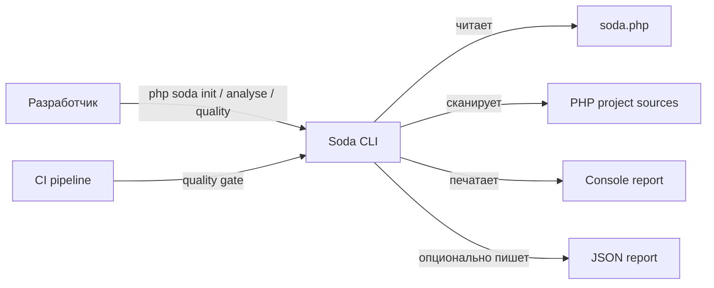
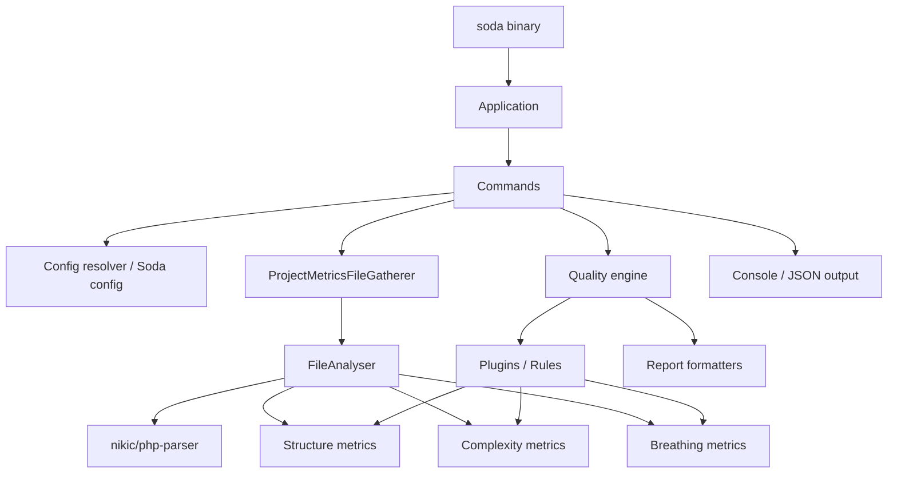
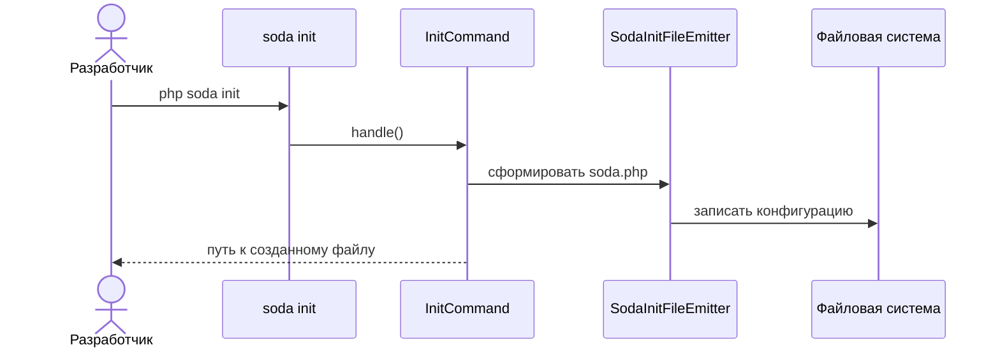
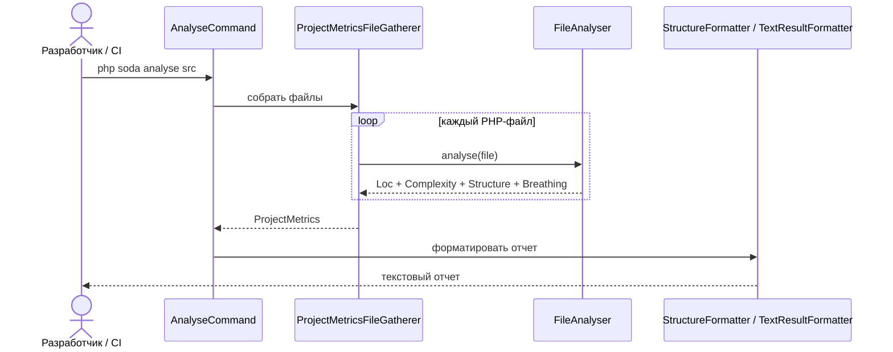
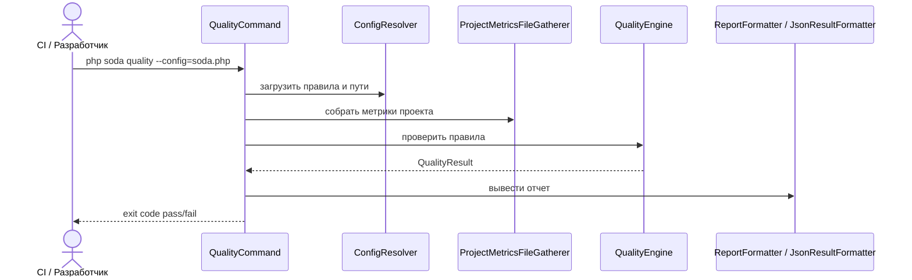
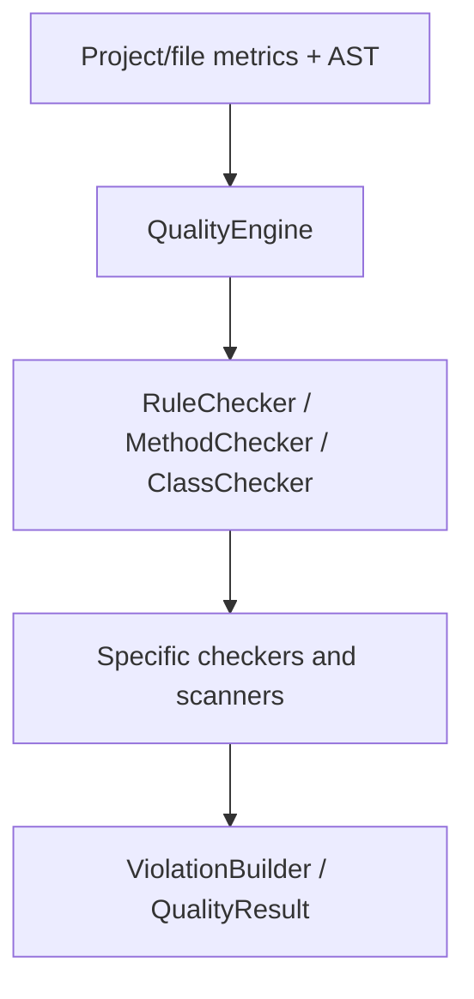
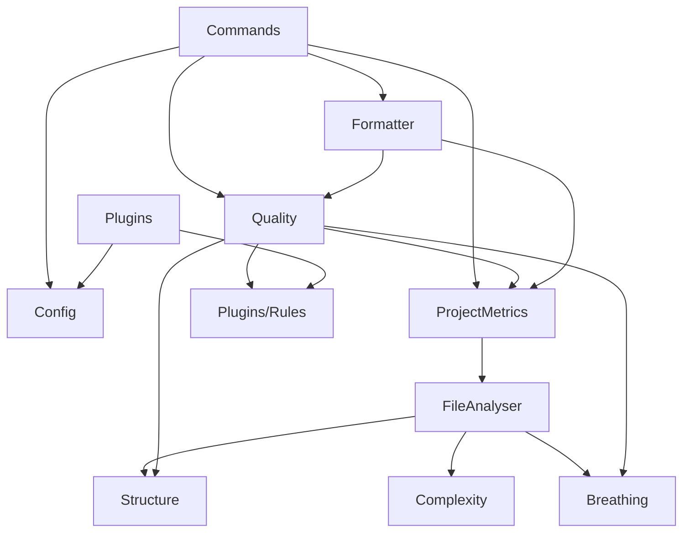

> Historical assessment of the implementation before the named-check simplification.
> Current architecture and migration: [Project flow](PROJECT_FLOW.md), [Migration](MIGRATION.md).
> Earlier scores and API examples below do not describe acceptance of the current work.

# Living Document: Упрощение проекта

> Цель: постоянно уменьшать сложность и LOC без добавления нового функционала.
> Последнее обновление: 2026-08-08

---

## 1. Текущее состояние системы (As-Is)

### 1.1 Context (C4 Level 1)

Soda — PHP CLI-инструмент для автоматической проверки качества кода по метрикам структуры, сложности, читаемости и правилам проекта. С ним взаимодействуют разработчики локально и CI-пайплайны в pull request / build-процессах, чтобы получать fail-fast quality gate до ревью. Входом служат PHP-файлы и конфигурация `soda.php`, выходом — текстовый отчет в консоли и, опционально, JSON-отчет.

### 1.2 Containers / Основные части (C4 Level 2)

Главные части системы:

| Контейнер / часть | Назначение | Основные файлы |
|-------------------|------------|----------------|
| CLI entrypoint | Запускает приложение и команды | `soda`, `soda.php`, `src/Application.php` |
| Commands | Обрабатывают пользовательские команды `init`, `analyse`, `quality`, `list-rules` | `src/Commands/*` |
| Config | Описывает fluent API конфигурации, правила, плагины и генерацию `soda.php` | `src/Config/*`, `src/Quality/Config/*` |
| File metrics pipeline | Парсит PHP-файлы, строит AST, собирает LOC, complexity, structure, breathing | `src/FileAnalyser.php`, `src/ProjectMetricsFileGatherer.php`, `src/Structure/*`, `src/Complexity/*`, `src/Breathing/*` |
| Quality engine | Превращает метрики и AST-проверки в violations | `src/Quality/*` |
| Plugins and rules | Доставляют стандартные наборы правил и конкретные проверки | `src/Plugins/*`, `src/Plugins/Rules/*`, `src/Quality/Rule*/*` |
| Formatters | Форматируют результаты анализа и quality gate | `src/Formatter/*`, `src/Quality/Report/*` |
| Tests and fixtures | Проверяют CLI, правила и анализаторы | `tests/*` |

### 1.3 Основные сценарии (ключевые потоки)

#### Сценарий 1: Инициализация конфигурации

#### Сценарий 2: Анализ метрик проекта

#### Сценарий 3: Quality gate по конфигу

#### Сценарий 4: Список доступных правил

#### Сценарий 5: Проверка конкретных smell/rule-анализаторов

### 1.4 Карта модулей и ответственности

| Модуль / Файл / Компонент | Основная ответственность | Побочные ответственности | LOC (примерно) | Кто использует | Чистота (1–5) | Запахи |
|---------------------------|---------------------------|---------------------------|----------------|----------------|---------------|--------|
| `src/Application.php` | Сборка CLI-приложения и команд | DI для `QualityAnalyser` | 25 | `soda` binary | 4 | Минимальный composition root |
| `src/Commands/QualityCommand.php` | Запуск quality gate | Config loading, report writing, exit code | 167 | CLI / CI | 3 | Mixed concerns, orchestration + IO |
| `src/Commands/AnalyseCommand.php` | Запуск анализа метрик | Форматирование CLI-ответа | 77 | CLI | 4 | Небольшая связность с форматтерами |
| `src/Commands/InitCommand.php` | Создание `soda.php` | UX сообщений CLI | 109 | CLI | 4 | Низкий риск |
| `src/Config/SodaRule.php` | Fluent API настройки отдельного правила | Хранение threshold/scope/metadata | 227 | Config, rules | 3 | Крупный value/config object |
| `src/Config/SodaConfig.php` | Root-конфигурация Soda | Нормализация путей, excludes, plugins | 161 | Commands, quality config | 3 | Temporal coupling в порядке построения |
| `src/FileAnalyser.php` | Анализ одного PHP-файла через AST visitors | Создание parser/traverser/visitors | 85 | Project metrics gatherer | 4 | Жесткая сборка зависимостей внутри метода |
| `src/ProjectMetricsFileGatherer.php` | Обход файлов проекта и агрегация метрик | Исключения путей, LOC summary | 76 | Commands | 4 | Может расти в сторону god orchestrator |
| `src/Structure/*` | Сбор структурных метрик AST | Статистика, merger, handlers | ~944 | FileAnalyser, rules, formatters | 3 | Много handler-классов, риск дробления без ясной границы |
| `src/Breathing/*` | Readability/perceptual metrics | Token pipeline, calculators, AST LCF | ~1 400+ | FileAnalyser, breathing rules | 3 | Много маленьких калькуляторов, возможная дубликация нормализации |
| `src/Complexity/*` | Cyclomatic complexity с учетом enum | Интеграция с sebastian/complexity | ~142 | FileAnalyser | 4 | Низкий риск |
| `src/Quality/*` | Ядро quality gate, контексты, visitors, rule surfaces | Report helpers, scanners, naming/tell-dont-ask logic | ~8 000+ | QualityCommand, plugins/rules | 2 | God area, высокая связность, смешение rule DSL и AST-проверок |
| `src/Plugins/*` | Наборы правил по умолчанию | Композиция structural/naming/breathing/complexity plugins | ~200+ | Config, docs examples | 4 | Возможное дублирование между standard plugin и специализированными |
| `src/Plugins/Rules/*` | Legacy/adapter-конкретные правила | Иногда собственный анализ AST | ~2 500+ | Plugins, config users | 2 | Дублирование с `src/Quality/Rule*`, shotgun surgery |
| `src/Formatter/*` | Текстовые/JSON/structure/dependencies отчеты | Size formatting helpers | ~665 | Commands | 4 | Умеренная связанность с shape result objects |
| `tests/end-to-end/*` | CLI-регрессии | Temp config fixtures | ~N/A | CI | 4 | Временные init-temp артефакты нужно периодически чистить |

### 1.5 Граф зависимостей (важное)

- Циклические зависимости: явных циклов на уровне верхних каталогов при первичном осмотре не зафиксировано; требуется подтвердить отдельным dependency analyzer.
- «Бог-модули»: `src/Quality/*` как область выглядит главным кандидатом: 141 namespace-entry и много поддоменов внутри одного верхнего пространства.
- Второй риск: параллельное существование `src/Plugins/Rules/*` и `src/Quality/Rule*/*` может создавать двойной источник правды для правил.

---

## 2. Карта проблем (Smell Map)

### 2.1 Логические архитектурные запахи

- Mixed Concerns
  - Где: `src/Commands/QualityCommand.php`, частично `src/Commands/AnalyseCommand.php`.
  - Почему это плохо: команды одновременно управляют CLI-параметрами, загрузкой конфигурации, анализом, форматированием и exit code; любое изменение потока может трогать один и тот же файл.
  - Критичность: средний.

- God Module
  - Где: верхняя область `src/Quality/*`.
  - Почему это плохо: в одном namespace собраны engine, config, AST visitors, report, rule definitions, naming, readability, smell-specific scanners; трудно понять, где должен жить новый или удаляемый код.
  - Критичность: высокий.

- Shotgun Surgery
  - Где: rule definitions в `src/Quality/RuleStructure/*`, concrete checks в `src/Quality/Rule/*`, adapters/legacy rules в `src/Plugins/Rules/*`, plugins в `src/Plugins/*`.
  - Почему это плохо: добавление/удаление одного правила может требовать правок в нескольких слоях.
  - Критичность: высокий.

- Leaky Abstraction
  - Где: formatters и quality checks опираются на shape внутренних result/metrics objects.
  - Почему это плохо: формат вывода может зависеть от деталей сбора метрик, что затрудняет удаление промежуточных полей.
  - Критичность: средний.

- Temporal Coupling
  - Где: `ConfigResolver`/`SodaConfig`/plugins/rules и flow команды `quality`.
  - Почему это плохо: корректность зависит от порядка загрузки config, применения plugins, сборки project metrics и запуска checks.
  - Критичность: средний.

- Complex Conditional Logic
  - Где: rule checkers/scanners в `src/Quality/Rule/*`, `src/Plugins/Rules/*`, visitors.
  - Почему это плохо: AST-проверки обычно копят условия по node types, modifiers, scopes, thresholds; это повышает риск при удалении веток.
  - Критичность: средний.

- Dead / Speculative Code
  - Где: `tests/end-to-end/init-temp-*`, возможные legacy rules в `src/Plugins/Rules/*`, bridge-классы между старой и новой моделью rules.
  - Почему это плохо: временные артефакты и дублирующие rule surfaces размывают сигнал, увеличивают LOC и стоимость поиска.
  - Критичность: средний.

- Feature Envy
  - Где: форматтеры и команды, если они сами собирают данные вместо того, чтобы получать готовые DTO/report models.
  - Почему это плохо: логика представления начинает знать слишком много о расчетах.
  - Критичность: низкий/средний.

### 2.2 Структурные проблемы

- Слишком большие файлы/модули:
  - `src/Plugins/Rules/UselessVariable/UselessVariableAnalyser.php` (~315 LOC)
  - `src/Plugins/Rules/UnusedMethods/UnusedMethodAnalyser.php` (~305 LOC)
  - `src/Quality/Naming/MethodRedundancyChecker.php` (~257 LOC)
  - `src/Quality/TellDontAsk/TellDontAskVisitor.php` (~245 LOC)
  - `src/Config/SodaRule.php` (~227 LOC)

- Высокая связность:
  - `QualityCommand -> Config + ProjectMetrics + QualityEngine + ReportFormatter`.
  - `FileAnalyser -> parser + visitors + structure + complexity + breathing`.
  - `Plugins -> concrete rules -> quality rule definitions`.

- Низкая связанность (cohesion):
  - `src/Quality/*` содержит несколько поддоменов с разными скоростями изменения.
  - `src/Plugins/Rules/*` может смешивать public user-facing rules и internal analysis helpers.

- Дублирование логики:
  - Потенциальное дублирование rule identity / presentation / threshold metadata между `Quality/RuleStructure`, `Plugins/Rules` и docs.
  - Потенциальное дублирование AST traversal helpers между `Structure`, `Quality/Visitor`, `Quality/Rule`, `Plugins/Rules`.

### 2.3 Матрица мнений для цикла упрощения

Перед каждой правкой выбираем один кандидат из раздела 4 и прогоняем его через матрицу. Это не попытка угадать реальные слова людей, а набор инженерных линз, вдохновленных их публично известными подходами.

| Голос | Что спросил бы про упрощение | Как это влияет на решение | Мнение по текущему циклу | Предложение к правилам, что бы мы могли улучшить инструмент |
|-------|-------------------------------|----------------------------|---------------------------|-----------------------------------------------------------|
| David Heinemeier Hansson | Можно ли сделать проще, прямее и без церемоний? | Удалять очевидный примерный мусор из production без церемоний | Поддерживает: `BreathingPerceptualIndices` теперь содержит только `collect()` и не хранит demo-методы `foo/bar/baz` | Добавить правило `no_example_methods_in_production`: в `src/` запрещать методы `foo`, `bar`, `baz` с комментариями вроде `Example`, `Bad comment`, если файл не является fixture/test; доказательство: `src/Breathing/BreathingPerceptualIndices.php` содержал такие методы |
| laravel taylor otwell | Останется ли API и DX приятным для пользователя? | Production API должен показывать только реальные affordances, не учебные примеры | Поддерживает: public API internal-класса стал честнее; `BreathingPerceptualIndices::collect()` не изменился | Добавить правило `internal_class_public_method_budget`: для `@internal final` utility classes в `src/` разрешать только методы, которые используются поиском или покрыты тестом; demo public methods подсвечивать |
| егор бугаенко | У объекта/модуля одна ясная ответственность или он прячет чужие обязанности? | Примерный код и реальные расчеты не должны жить в одном объекте | Поддерживает: класс снова отвечает только за сбор perceptual indices | Добавить smell rule `mixed_fixture_and_production_code`: если production class содержит комментарии/методы с учебными маркерами (`Example`, `Bad`, `foo`) и при этом используется runtime-кодом, предлагать удалить или перенести в tests/fixtures |
| Fabien Potencier (symfony) | Не нарушаем ли стабильный контракт и предсказуемость CLI? | Удалять только неиспользуемые demo members, не меняя вызываемый метод | Поддерживает: `rg` показал runtime-использование только `BreathingPerceptualIndices::collect()` | Добавить правило `unused_public_member_in_internal_class`: public method в `@internal` class должен иметь внешнюю ссылку в `src/tests/docs`; иначе violation с рекомендацией сделать private/delete |
| Jordi Boggiano (composer) | Что увидит downstream-пользователь пакета и autoload? | Classmap не должен экспортировать случайные public methods как часть доступной поверхности | Поддерживает: classmap class остался, но его лишние public methods удалены | Добавить rule `classmap_surface_hygiene`: для Composer classmap packages считать public methods in `src/` потенциальной surface area и требовать use/reference или documented reason |
| Martin Fowler | Уменьшает ли изменение стоимость понимания без смешения рефакторинга и поведения? | Удалять dead/speculative code с поиском и targeted tests | Поддерживает: behavior-preserving deletion, 21 LOC removed, no references to removed markers left | Добавить rule `speculative_code_marker`: комментарии `Example`, `Bad comment`, placeholder bodies like `// ..` в production должны быть violation, если файл не находится под `tests/` или `docs/` |

---

## 3. Правила безопасного удаления кода

Чёткие критерии, по которым можно удалять:

1. Код нигде не вызывается (подтверждено `rg` по class/function/rule id + тестами).
2. Дублирование: одна и та же логика есть в двух местах -> оставляем одну реализацию, вторую удаляем после переноса тестов.
3. Абстракция используется только в одном месте -> можно инлайнить, если не является публичным API config/rule DSL.
4. Feature-flag / конфиг, который уже никогда не меняется.
5. Ветка условия, которая всегда true/false по текущему contract или типам.
6. Модуль/функция, чья ответственность размыта и легко переносится в уже существующий владелец.
7. Временные тестовые артефакты (`init-temp-*`) можно удалять, если они не участвуют в assertions и воспроизводятся тестами.
8. Rule metadata в нескольких местах можно схлопывать только после проверки docs, JSON report contract и `list-rules`.
9. Public classes из `src/Config/*` и `src/Plugins/*` удалять только после оценки обратной совместимости Composer package.
10. AST-checker можно упрощать только при наличии fixture, который покрывает удаляемую ветку, или после добавления такого fixture.

---

## 4. Кандидаты на удаление / упрощение

| Приоритет | Что | Почему можно убрать/упростить | Ожидаемый эффект (LOC / сложность) | Статус | Риски |
|-----------|-----|-------------------------------|------------------------------------|--------|-------|
| Высокий | Развести/схлопнуть двойную модель правил `src/Plugins/Rules/*` vs `src/Quality/Rule*/*` | Похоже на два слоя, которые описывают близкую ответственность; уже убран one-use helper и выделен internal adapter для 39 wrappers | Средний/высокий: меньше мест для изменения правила | In progress | Можно сломать public config API или docs |
| Высокий | Проверить временные `tests/end-to-end/init-temp-*` | Название похоже на артефакты тестового запуска; `rg` показал, что их имена не используются, кроме генерации в `init.phpt` | 476 LOC, меньше tracked мусора в e2e | Done | Покрыто `tests/end-to-end/init.phpt` и unit-тестом `InitCommandTest` |
| Средний | Выделить orchestration из `QualityCommand` или, наоборот, инлайнить одноразовые посредники рядом с ней | Команда держит много шагов одного сценария | Средний: проще читать flow quality gate | Todo | Риск переместить сложность без удаления |
| Средний | Инвентаризировать singleton-use helpers в `src/Breathing/Calc/*` | Много маленьких calculators может быть оправдано, но часть может использоваться один раз | Низкий/средний: меньше файлов и переходов | Todo | Метрики readability чувствительны к формулам |
| Средний | Проверить дубли AST traversal helpers | AST scanning есть в `Structure`, `Quality/Visitor`, `Quality/Rule`, `Plugins/Rules` | Средний: меньше условной логики | Todo | Обобщение может сделать код менее понятным |
| Средний | Удалять fixture/example code из production classes | `BreathingPerceptualIndices` содержал demo methods `foo/bar/baz` с `Example`/`Bad comment` | 21 LOC, меньше ложной public surface | Done | Низкий: `collect()` не менялся, removed methods не имели ссылок |
| Низкий | Унифицировать форматирование размеров и отчетов | `Formatter/*` компактны, но могут знать лишнее о metrics shape | Низкий | Todo | Report output может быть контрактом |
| Низкий | Уточнить public/internal границы config classes | `SodaRule` и `SodaConfig` крупнее остальных config files | Средний: проще безопасно удалять internal API | Todo | Backward compatibility Composer-пакета |
| Низкий | Убрать дубли в hygiene-конфигах | `.gitignore` содержал повтор `/.phpunit.cache` | 1 LOC, меньше шума в maintenance-файле | Done | Нет: повторное ignore-правило не меняет поведение |

---

## 5. Журнал удалений (Changelog упрощения)

| Дата       | Что удалили / упростили      | LOC убрано | Почему было безопасно          | Что проверили          | Коммит / PR |
|------------|------------------------------|------------|--------------------------------|------------------------|-------------|
| 2026-08-08 | Удалены demo methods `foo/bar/baz` из `BreathingPerceptualIndices` | 21 | `rg` показал, что runtime использует только `BreathingPerceptualIndices::collect()`; удаленные методы были placeholder/example code | pending targeted breathing tests + `composer phpstan` | pending |
| 2026-08-08 | Выделен `QualityRuleAdapter` для 39 plugin wrappers | 52 | Повторы `new QualityConfig(...) -> checker->check()` были одинаковыми для simple rules и options-rules; wrapper с exceptions оставлен явным | `composer dump-autoload --optimize`, targeted unit filters, `composer phpstan` | pending |
| 2026-08-08 | Инлайн `MultilinePhpDocComment` в `MultilinePhpDocNodeScanner` | 17 | `rg` показал единственного потребителя; helper не был public plugin rule и не имел состояния | `composer test:unit -- --filter MultilinePhpDocTest`, `composer phpstan` | pending |
| 2026-08-08 | Убран повтор `/.phpunit.cache` из `.gitignore` | 1 | Повторное ignore-правило полностью дублировало соседнюю строку | Ручная проверка `.gitignore` | pending |
| 2026-08-08 | Удалены tracked `tests/end-to-end/init-temp-*/soda.json` артефакты | 476 | `rg "init-temp\|soda.json"` показал, что конкретные temp-директории не используются; `init.phpt` сам создает и чистит временную папку | `composer test:unit -- --filter InitCommandTest`, `vendor/bin/phpunit tests/end-to-end/init.phpt` | pending |
| 2026-08-08 | Создан baseline living document | 0 | Документ фиксирует карту системы и правила удаления | Ручная проверка структуры файла | N/A |

---

## 6. Быстрый чеклист перед любым удалением

- [ ] Есть ли тесты на это место?
- [ ] Поиск по всему проекту (вызовы, импорты, строки)
- [ ] Не сломает ли ключевые сценарии из раздела 1.3
- [ ] Обновил ли я таблицы в этом документе

## 2026-09-10 — expression rules and AST simplification

Removed `QualityAstVisitors`, `QualityAstVisitorBundle`,
`QualityAstPrimaryScanVisitorGroup`, `QualityAstPrimaryScanVisitors`,
`QualityAstFlowScanVisitors`, `QualityAstCouplingNamingVisitorGroup`, and
`QualityAstCouplingNamingVisitors`. They only assembled and passed visitors.
`QualityAstPipeline` now constructs and registers its own visitors directly;
its consumer and traversal tests use those visitors directly. Repository search
found no remaining executable references to the deleted classes.

Added two behavior-owning classes: `Config\Rule` integrates conditions with the
existing rule API and `RuleExpression` validates/compiles phplrt syntax. Existing
rules retain full metrics; expression-only configurations select required work.
See `docs/RULE_EXPRESSIONS.md` and `scripts/benchmark-rules.php` for the contract
and reproducible comparison. Historical naming-audit tables are unchanged.

Callable ownership was simplified during regression review: the shared trait
now uses a stack of named/anonymous callable scopes; redundant class-name stacks
were removed in favor of AST parents. Return/try-catch/nesting counters restore
outer scopes correctly, and cyclomatic scans skip nested callable/class bodies.
`ConditionRecorder` receives its current method explicitly. Enum method names
and attribute dependencies have regression coverage. No new helper hierarchy
was added for these fixes.

At this migration checkpoint, self-quality still failed and the new findings
were recorded explicitly. The subsequent cleanup below closes those findings;
current validation is recorded in `docs/RULE_EXPRESSIONS.md`.

## 2026-09-10 — strict self-quality cleanup

The subsequent cleanup closes the previously documented findings. The final
local suite passes 715 tests / 7807 assertions; performance budgets pass 2 tests /
6 assertions. Self-quality reports zero findings with all three multiline
PHPDoc rules enabled, and Pint/PHPStan/Rector checks pass. Source hashes were
checked for changes during verification.

Removed 16 internal classes and introduced `FileRules`, `PropertyMetrics`,
`TraitAdaptations`, `ArchitectureDeclarationProbe` and `CallableMetricsVisitor`:
315 → 304 PHP source files, a net reduction of eleven classes. Engine assembly
and evaluation no longer require forwarding classes; per-method metrics use one
record. One collector replaces five callable visitors and owns their scope stack;
the pipeline retains
an explicit ordered registration list. Function-effect classification is a
lookup table, and constructor metadata is shared with config generation.

Rule thresholds and expected passing test output remain intact. Interface order
is deliberately preserved by Pint because the first interface is used as the
primary class role. Legacy naming-audit tables above are historical snapshots.
Current execution details and limitations are in `docs/RULE_EXPRESSIONS.md`.
